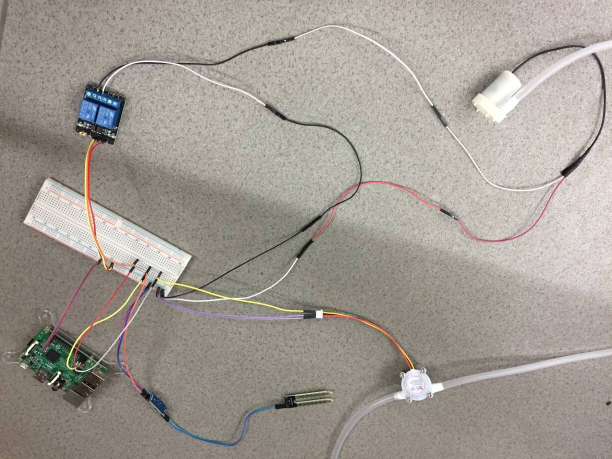
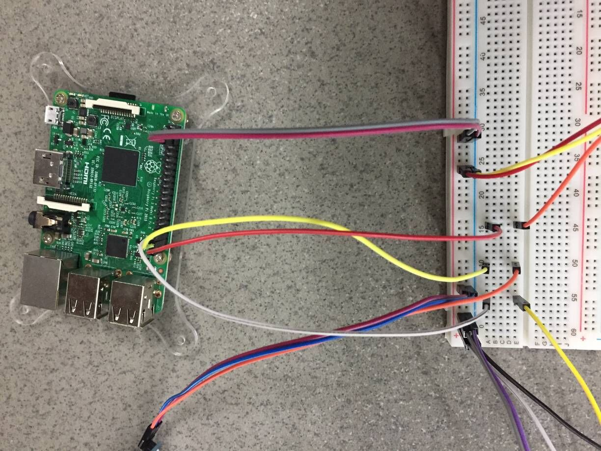
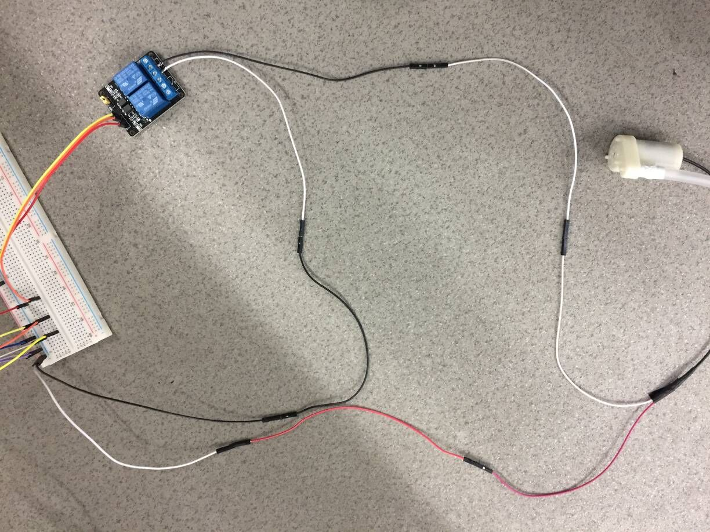

# auto-watering

## 需要的配件
- 树莓派
- 土壤湿度传感器（YL-69）
- 继电器
- 水流传感器（YF-S401）
- 水泵
- 软管
- 杜邦线若干
- 面包板

## 使用

### 整体连接图

### 树莓派引脚

### relay 与水泵连接图

*图中水泵直接用树莓派 5v 供电，也可以接外面电源供电。*

图左上角的水泵插入水槽， 左下角的软管末端和土壤湿度传感器插入植物土壤中。
当土壤湿度不足时，会会启动水泵抽水给植物浇水，当水槽中水位过低或土壤湿度达到标准，水泵停止抽水。    
*当水槽水位过低导致水泵停止，重新加完水后，需要重启容器才能正常工作。*
